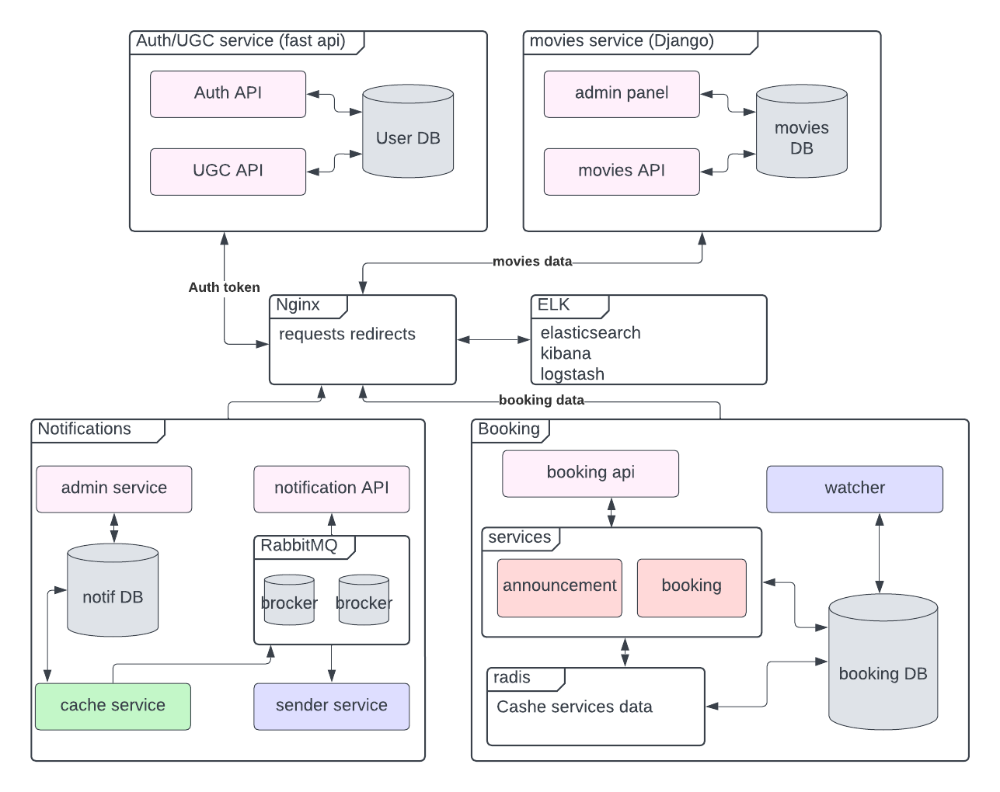

# Дипломный проект "Бронирование билетов"

## Проектное задание

Здорово будет связать фильмы с походами в кино. Не всем нравится сидеть дома и
смотреть фильмы в одиночку. Иногда хочется их посмотреть с компанией единомышленников.

Для реализации такой возможности от вас требуется реализовать для определенной 
группы фильмов кнопку покупки билета в кино. Система должна позволять пользователям
создавать свои расписания, фильмы и место сбора, а также возможное количество людей
давать возможность любому пользователю выбирать пользователя-хоста 
(тот, который предлагает фильм и место) и затем дату + время фильма. 
Для данной задачи реализовывать оплату не нужно, достаточно бронировать 
билеты и не давать забронировать больше билетов, чем есть мест у конкретного человека. 


Так как эти посиделки камерные, то заданием со звездочкой будет придумать систему 
оценки пользователя-хоста и пользователя-гостя (тот, который пришел на совместный просмотр).

## Используемые технологии

Nginx - проксирование внешних запросов
Fastapi - асинхронный фреймворк для создания API
PostgreSQL - база данных для хранения данных о событиях и бронировании
Redis - база данных для хранения кэша
Docker - развертывание проекта


## Основные сервисы проекта

- Auth API - регистрация пользователя, информация о пользователе
- UGC API - информация о друзьях пользователя
- Movie API - информация о фильмах
- Booking API - бронирование билетов
- Url generation - генерация коротких ссылок
- Notification - отправка уведомлений
- Graylog - логирование событий микросервисов


## Общая схема проекта



# Запуск проекта

1. Скопировать/заполнить файл настроек окружения
```shell
cp example.env .env
```

2. Создать внешнюю сеть "project-network" командой:
```shell
docker network create 'project-network'
```

3. Запустить контейнер ELK для организации логирования
```
cd ELK
docker-compose up
```

Доступ в интерфейс elastic. Выбрать нужные метрики и сервисы.
```
http://localhost:5601/app/home#/
```

4. Запустить контейнер основного сервиса
```
cd ../
docker-compose up
```

## BOOKING API

Сервис бронирования билетов.

Ссылка на openapi:
```
http://localhost:8080/api/openapi#/
```


### Организатор

- Автор создает объявление о событии, "Собираюсь посмотреть фильм завтра вечером, ищу компанию".
- Другие пользователи могут подать заявку на участие в событии. Создают запись.
- Автор может вносить изменения в объявление.
- При внесении изменений в объявление - всем участникам и потенциальным гостям приходит уведомление и ссылка на анонс.
- За 24 часа до события - всем участникам приходит уведомление и ссылка на анонс.
- За 1 час до события - всем участникам приходит уведомление и ссылка на анонс.

  - автору приходят заявки на участие в событии от гостей бронирования.
  - автору приходит уведомление и ссылка на подробную информацию о состоянии бронирования.
  - автор может принять или отклонить заявку на участие в событии.
  - если состояние бронирования изменяется - автору и гостю приходит уведомление и ссылка на подробную информацию о состоянии бронирования.
  - когда заявка одобрена - сведения о госте появляются в информации о событии.

### 2. Сценарий гость

- Пользователь может посмотреть подробную информацию о событии анонса.
- Для поиска подходящего события, пользователь использует фильтры и получает список объявлений.
- Пользователь отправляет заявку на участие в событии. Создается запись бронирования.
- Автору приходит уведомление и ссылка на подробную информацию о состоянии бронирования.
- Если информация о событии изменилась - пользователю приходит уведомление и ссылка на анонс.
- Когда статус заявки меняется - пользователю приходит уведомление и ссылка на бронирование.

### Анонсы

- Нельзя создавать дубликаты объявлений от одного пользователя
- Проверять права пользователя перед изменением записи

### Бронирование

- Нельзя быть гостем на своем событии
- Нельзя регистрироваться на события с одним временем начала
- Проверять права пользователя перед изменением записи
- Показывать пользователю только его записи

## AUTH API

Сервис-заглушка для имитации регистрации пользователей, получения данных о 
пользователе, получения группы пользователя.

Ссылка на openapi:
```
http://localhost:8080/auth/api/openapi#/
```


Регистрация пользователя
```
POST

/auth/v1/register/
```

Получение данных пользователя
```
POST

/auth/v1/user_info/{uuid}
```

Получение группы пользователя
```
POST

/auth/v1/user_group/{group}
```


## UGC API

Сервис-заглушка для имитации обзоров на фильмы, подписок на фильмы, оценки 
рейтинга фильма.

Ссылка на openapi:
```
http://localhost:8080/ugc/api/openapi#/
```


Информация об обзоре
```
POST

/ugc/v1/review_info/{movie_id}/{user_id}/{review_id}
```

Информация о подписке
```
POST

/ugc/v1/subscribers/{movie_id}
```

Информация о рейтинге
```
POST

/ugc/v1/likes_count/{review_id}
```


## MOVIES API

Сервис-заглушка для получения данных о фильме.

Ссылка на openapi:
```
http://localhost:8080/movie/api/openapi#/
```


Информация о фильме
```
POST

/movie_api/v1/movie/{uuid}
```

## Graylog

ссылка на схему
